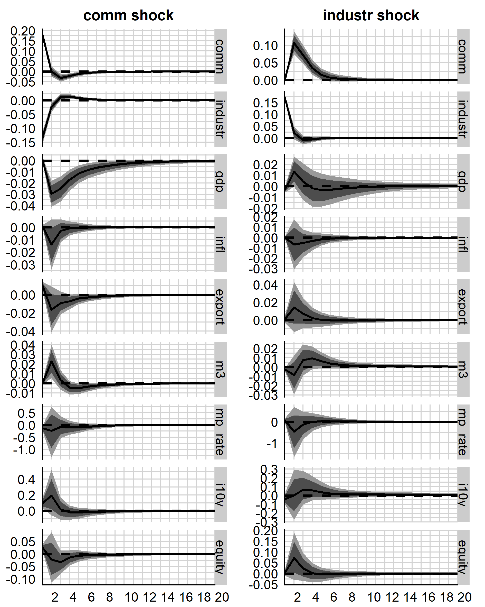
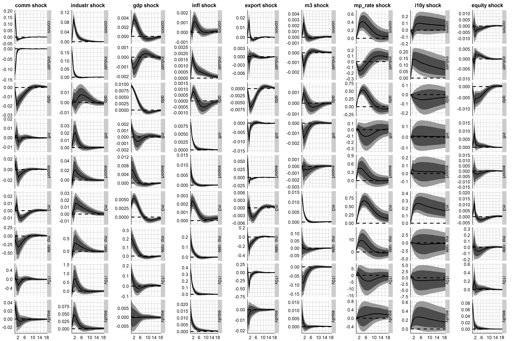

```{r eval=TRUE, echo=FALSE, message=FALSE, warning=FALSE}
options(knitr.table.format = "latex") 

table_pca <- readr::read_delim("./appendix/table_data.csv", ";", na = "")
table_pca <- knitr::kable(table_pca, format = "latex", caption = "Data used in the VAR model")
table_pca <- kableExtra::kable_styling(table_pca, full_width = FALSE)
kableExtra::footnote(table_pca, general = c("* Gaps filled with short-term (3M) Interbank rates", 
                                             "** M2 used due to availability", 
                                             "*** Variable dropped due to availability"))
```

```{r eval=TRUE, echo=FALSE, message=FALSE, warning=FALSE}
table_pca <- readr::read_delim("./appendix/table_datasources.csv", ";", na = "")
knitr::kable(table_pca, format = "latex", caption = "Data used in the VAR model")
```


```{r eval=TRUE, echo=FALSE, message=FALSE, warning=FALSE}
table_pca <- readr::read_delim("./appendix/table_commsingle.csv", ";", na = "")
knitr::kable(table_pca, format = "latex", caption = "Alternative, country-specific commodity variables")
```

{width=50%}

{width=50%}

{width=100%}


#### Principal Components Analysis

To establish which index data was to be used for our VAR-Model we have run multiple PCAs with different data sets. As can be seen in table X.X, the KMO-Criterion of the datasets with different starting dates were not all ideal for PCA. Additionally, it must be mentioned that the several runs were also undertaken with other timeseries such as a precious metals index. However, this yielded insufficient results. Therefore an iterative approach was taken, reducing the variables of the analysis, if components did not load variables or vice versa - as described by Maier & Hatzinger (2014). Finally, this resulted in a PCA with the timeseries seen in table X.XX. As can be seen in table X.XXX, the principal components that can be identified have an eigenvalue of 7.79 and 2.68 respectively. This indicates that both components can be used going forward, as both are well above the cut-off value of one. Cumulatively the components cover 81 percent of the total variance in the data set - loosely meaning that 81 percent of the information in the original data set is conserved when using these components.

```{r eval=TRUE, echo=FALSE, message=FALSE, warning=FALSE}
table_pca <- readr::read_delim("./appendix/table_pca.csv", ";", na = "")
knitr::kable(table_pca, format = "latex", caption = "Selection of PC Analyses")
```

```{r eval=TRUE, echo=FALSE, message=FALSE, warning=FALSE}
table_pca <- readr::read_delim("./appendix/table_pcavariables.csv", ";", na = "")
knitr::kable(table_pca, format = "latex", caption = "Variables in the PCA")
```


```{r eval=TRUE, echo=FALSE, message=FALSE, warning=FALSE}
table_pca <- readr::read_delim("./appendix/table_pcafigures.csv", ";", na = "")
knitr::kable(table_pca, format = "latex", caption = "Key figures of the PCA")
```


{width=50%}

{width=50%}
