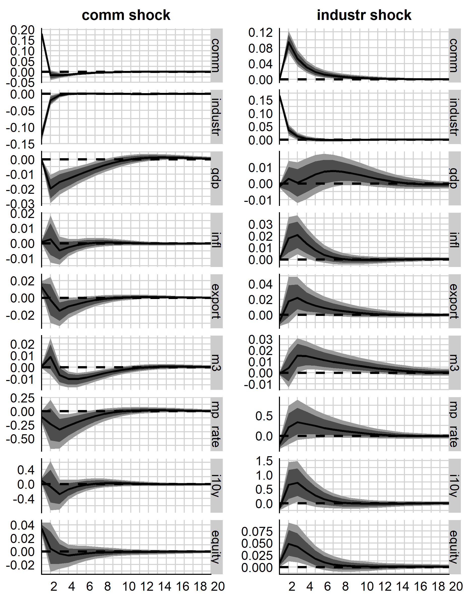
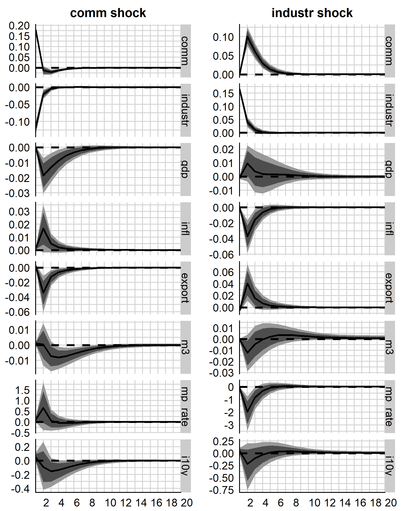

\newpage

# Introduction

The sources and drivers of business cycles have persistently been one of the main subjects of macroeconomic research and will most likely remain a staple of the discipline. The Vector autoregressive (VAR) models proposed by Chris Sims (1980) as a method for policy analysis have shaped the field ever since. A vast amount of literature focuses on the US business cycle and considers various shocks, e.g. due to technology, monetary policy or commodity prices. However, the focus on the US, be it due to data availability or importance of the country’s economy, means that a vast amount of information about business cycles has been left out - other countries and their data have widely been neglected. On the other hand, research combining business cycles and commodity prices has mainly dealt with generic commodity price indices or specifically the oil price.  
This paper attempts to address both of these issues by considering a multitude of commodity prices and indices for implementation in structural VAR models spanning four resource-dependent economies (Australia, Chile, Norway and South Africa). To our best knowledge this approach has not been taken before, setting our work apart from the vast literature we base it on. The theory is built upon the work of Gubler et al. (2013) on an extended set of business cycle shocks, that is comprised of shocks via monetary policy, technology and commodity prices. Gubler et al. study the effect of commodity price shocks in addition to the shocks presented by Altig et al. (2011) via a structural VAR (SVAR) model of the US business cycle. The find commodity price shocks to be an important source of fluctuation, especially in regard to inflation (Gubler et al. 2013, p. 20). Roch (2017) focuses the analysis on terms-of-trade shocks in VAR models of Chile, Colombia and Peru. The commodity price indices used are country-specific and constructed from international prices and country-level export data (Roch 2017, p. 6-7). Roch finds a “substantial impact [of terms-of-trade shocks] on fiscal aggregates” (Roch 2017, p. 4), as well as a significant influence of fluctuations on key macroeconomic variables. Further work on international business cycles was done by Mallick and Sousa (2012), who evaluate the transmission of monetary policy in five emerging market economies (Brazil, Russia, India, China and South Africa). They use several types of VAR models and uncover significant effects of a positive shock to commodity prices (Mallick & Sousa 2012, p. 693).  
We consider a structural VAR, identified via Cholesky decomposition and interpret its impulse responses. Furthermore, we reduce the dimensionality of multiple commodity price time series via Principal Component Analysis (PCA). We find significant impacts of commodity prices across models and find evidence of the benefit of using PCA in the form of substantially less impactful responses to non-transformed commodity variables. This document is structured as follows. In section 2 the methodology regarding data, PCA and SVAR model are discussed. In section 3 results are presented and outlined. Section 4 concludes.

# Methodology

## Data

In pursuit of a scientifically sound foundation to build further analysis on, the initial concern of this paper was the definition and selection of *resource-dependent* countries. To avoid arbitrariness this was done in a data-based manner. For this, World Bank data on economic variables, resource rents and metal exports were utilised in the creation of four indicators of resource-dependence. These are the ratios of subsoil wealth to GDP, natural to total wealth, resource rents to GDP and metal exports to total exports. Together with constraints on size of the economy and ultimately data availability, these indicators were used to single out Australia, Chile, Norway and South Africa for our analysis. 
The major source for economic data was the OECD, with time series of quarterly GDP, trade, consumer prices, interest rates and many more. While a wide array of data is readily available, length and frequency of time series and comparability between countries posed some challenges. E.g. vital time series on monetary policy rates were mostly gathered from national central banks and - in the case of Australia and Norway - had to be extended with short-term interbank rates. Data on unemployment rates, exchange rates and other economic indicators were dropped due to issues with heterogeneity and availability. 
Market data was gathered via Bloomberg and Datastream and includes over forty commodity indices, individual resource prices and equity indices. However, the bulk of these time series only started in the 1990s, highlighting the dilemma of longevity versus abundance of data. For a more detailed overview of used data, its extent and its sources please consult Table 10.1 in the appendix.  
To achieve stationarity the variables, apart from interest rates, were transformed. Three different approaches were up for consideration - namely first-differences, log-differences and a Hodrick-Prescott filter. Of these, log-differences seemed to perform the best, with the exception of GDP, which was filtered via an HP filter, and the principal components of the resource data, where first-differences were applied.

## Vector Autoregression

Vector autoregressive (VAR) models are a generalization of univariate autoregressive (AR) models and are commonly resorted to as tools for investigating the effects of economic shocks. They are based on the notion of dynamic behaviour between the lags (*p*) of every model variable. A VAR model of order p may be referred to as *VAR(p)* model and can be expressed as:
$$y_t = A_1 y_{t-1} + ... + A_p y_{t-p} + u_t$$
Here $y_t$ is a *K*-dimensional vector of time series $x_t$, $A_{1, ..., p}$ are $(K x K)$ matrices of coefficients and $u_t$ is a $(K x 1)$ vector of the linearly unpredictable component of $y_t$. For shocks to have a distinct economic interpretation one may recover structural shocks from this reduced-form representation (Kilian & Lütkepohl 2017, p. 2). Consider:
$$B_0 y_t = B_1 y_{t-1} + ... + B_p y_{t-p} + w_t$$
With $B_{1, ..., p}$ as $(K x K)$ matrices of autoregressive slope coefficients and $w_t$ as a $(K x 1)$ vector of zero-mean structural shocks, that is serially uncorrelated with a diagonal covariance matrix $\Sigma_w$ of full rank (Kilian & Lütkepohl 2017, p. 2). This *structural* form representation is obtained by pre-multiplying by $B_0^{-1}$, such that $A_i = B_0^{-1} B_i$ and $u_t = B_0^{-1} w_t$. Thus, one has to estimate the matrix $B_0$ (or its inverse) to recover the structural model. Coming up with credible restrictions for this matrix is known as the *identification problem*. Whilst there are diverse approaches to this problem, this paper only takes the approach of recursive identification via Cholesky decomposition. As described by Kilian and Lütkepohl (2017, p. 216), the diagonal covariance matrix $\Sigma$ can be expressed as the product of two lower-triangular matrices $PP’$, with $B_0 = P$ as one possible solution. However, in order to receive meaningful results one needs to base the structure of *P* on proper economic rationale. The fact that *P* is a lower triangular matrix means that a certain causal chain (higher variables react to fewer shocks contemporaneously) is imposed on the data (Kilian & Lütkepohl 2017, p. 216) - a fact one has to base the ordering of the model's variables on. Considering the variables included in most of our models we order them as follows:  

1. Commodities
2. GDP
3. Inflation (CPI)
4. Exports
5. M3 Monetary Aggregate
6. Monetary Policy Rate
7. 10Y Government Bond Yields
8. Equity Prices  

We attempted to categorise the variables in three broad categories: (1) variables that react to monetary policy shocks with a lag; (2) the monetary policy rate; and (3) variables that adjust contemporaneously to a monetary policy shock. We limit the third group to fixed income and equity prices, which is broadly based on the notion of efficient markets (Fama 1970). In line with previous work (e.g. Mallick & Sousa 2012) we place the GDP, inflation and other macroeconomic variables towards the top. Commodity prices are placed on top, according to Kilian & Vega (2011), who formally test different identifying assumptions regarding oil prices. They find no compelling evidence of short-term feedback, i.e. at the monthly horizon, to macroeconomic news, thus lending support to theoretical models based on this hypothesis (Kilian & Vega 2011, p. 16-17). The chosen lag-lengths were based on the *Akaike Information Criterion* and resulting impulse responses and ended up at one for each model.

## Variable Selection

**Principal component Analysis** (PCA) can be used to reduce the dimensionality of a dataset with many interrelated variables, whilst also conserving as much of the variation present in the data set as possible (Abdi & Williams, 2010, Jolliffe, 2011, Stock & Watson, 2002a, Stock & Watson, 2002b). To achieve this, PCA focuses on variances, without neglecting covariances and correlations. Due to its versatile nature, PCA is one of the most widely utilised multivariate statistical techniques and has found application in a multitude of scientific disciplines (Abdi & Williams, 2010). The variables created in the PCA process can be useful for forecasting in macroeconomic analysis (Favero et al., 2005, Stock & Watson, 2002a, Stock & Watson, 2002b), where many different variables and time series are generally available. 
Since we want to model the effect of a plethora of commodity prices on business cycles within a VAR framework, it is beneficial to reduce the number of variables that are used in the estimation. VAR models benefit greatly from being set up parsimoniously and the reduction of dimensionality that can be achieved via PCA should lead to better results.  
Regarding the methodology consider the vector *x* with *p* random variables, where we are interested in the variances of the random variables and the structure of covariances and correlations between them. If the number of random variables is high, or the structure is complex, it is often helpful to look for few derived variables, that preserve the information of the variances, correlations and covariances, instead of examining them directly (Jolliffe, 2011). 
When using PCA these new, derived variables are called the principal components. They are uncorrelated and retain most of the variation present in the entire dataset (Jolliffe, 2011). Initially PCA finds a linear function $\alpha_1' x$ of the elements of *x* while maximizing variance, where $\alpha_1'$ is a vector of *p* constants. Hence: 
$$\alpha_1’x = \alpha_{11} x_1 + \alpha_{12} x_2 + ... + \alpha_{1p} x_p = \sum_{j=1}^p \alpha_{1j} x_j$$
Next, PCA looks for a linear function $\alpha_2' x$ that is uncorrelated with $\alpha_1'$ while also having maximum variance, and so on, so that the *k*-th stage yields the linear function $\alpha_k’ x$, again uncorrelated with all linear functions $\alpha_1' x, ..., \alpha_{k-1}' x$ and with maximum variance. Up to *p* principal components can be distinguished, although the aim is to find an amount *m*, such that $m<<p$, thus reducing the dimensionality of the dataset. The values of these resulting variables are called *factor scores*, and form their own time series (Abdi & Williams, 2010, Stock & Watson, 2002b).  
For PCA to be successful, the considered variables should be correlated, but not perfectly so, since this would hinder a reduction in the dimensionality. To evaluate wether PCA can be used to reduce dimensionality one may use the *KMO-Criterion* and the p-value of *Bartlett's Test of Sphericity*. Afterwards, a balance has to be struck between providing a sufficient amount of observations to the VAR model, whilst also capturing as much information as possible from the commodity markets. There are several established criteria for handling this tradeoff, although the exact cut-off points are somewhat subjective (Abdi & Williams, 2010). The number of principal components is determined via the components' eigenvalues, which are equal to the sum of squared factor scores. The Kaiser Criterion (Kaiser, 1961) suggests a cut-off eigenvalue of one and is chosen due to its prevalence and sufficient reduction of dimensionality.

Furthermore, **Bayesian Model Averaging** is used as an additional way of assessing the model's structure. In short, *BMA* deals with the question of which independent variables to include in a model. Conceptionally this would be done by obtaining the results of every feasible model and averaging them [@koop2003bayesian, pp. 266]. In practice it swiftly becomes an impossible task, as the number of possible combinations may very well be enormous. However, since the models considered here do not exceed nine variables, we are able to enumerate the entire model space using the R package *BMS* by @zeugner2015bayesian. 

# Results

## Variable Structure

For the optimal choice of dataset to be handled with PCA, several starting points of the commodity time series were considered. Ultimately the second quarter of 1979 was selected, as it yielded the strongest test-statistics with regards to the possibility of using PCA, while also being covered by a sizeable amount of the available time series. A *KMO*-Criterion of 0.803 and a highly significant p-value of Bartlett's Test of Sphericity (see Appendix, Table 99.9) indicate the suitability of PCA. The Kaiser Criterion yields two components that add a satisfactory amount of information to the model (see Appendix, Figure 96.69). The components have eigenvalues of 7.79 and 2.68, which are both well above the cut-off. Additionally, the components capture 60 and 21 percent of the sample variance - which is considered sensible (Jolliffe, 2011). Based on the resulting factor loadings one can distinguish between the variables in each component. Whilst the first component comprises time series of precious metals, agriculture & livestock and a generic commodity index, the second one contanins industrial metals. Thus we will refer to them as *Commodities* and *Industrial Metals* (labelled *comm* and *industr*).  

{width=50%}


The iteratively computed posterior inclusion probabilities (PIPs) provide an interesting overview of the data (Appendix, Plots 14.1-14.5), but should be interpreted with care. In the case of Australia the commodities' principal components display very low PIPs, a picture that holds for all variables. The Chilean data however, appear to be rather interconnected. The commodity variables show decent inclusion in models explaining the monetary policy rate, the monetary aggregate, exports and even GDP. The Norwegian PIPs are generally rather low, although the commodity components turn out relatively high, with high inclusion when explaining GDP and decent values for equity prices. For South Africa the PIPs turn out slightly higher - the principal components show up when explaining the monetary policy rate, inflation and GDP. Based on these results we would expect higher impacts of the commodity components for Chile and South Africa, while one could presume the lower interplay of variables for Australia and Norway to lead to less convoluted models.

## Impulse Responses

The impulse responses, as pictured in Plots 3.1 and 3.2 (as well as Appendix, Plots 17.1 - 17.6) show us the reaction of the model's variables to specific shocks. The solid black line corresponds to the mean response; the dark- and light-gray areas cover 25-75 percent and 16-84 percent posterior confidence intervals among the 10,000 iterations.  

{width=50%}

{width=50%}


In very loose terms the results do not hold any huge surprises. Technology shocks roughly turn out as expected, and do so rather significantly. In the cases of inflation and monetary aggregates the responses may be pronounced, but tend to dissipate very quickly. The picture of monetary policy shocks is rather diverse - responses vary across countries in direction, significance and persistence.
A shock to the first principal component (labelled *comm*) impacted GDP negatively in all countries, but Chile. Similar things same held for inflation, which received a boost except for Chile, where it fell, and Norway where it fell insignificantly. The impacts on export were rather negative for resource-dependent economies, but positive on the control-group of Germany and the US. The monetary policy rate reacted in an expansionary matter for Australia and the US, but insignificantly or contractionarily for the other countries. In German and South African models we can also observe a short, but significant jump in equity prices as a reaction to a shock on this first principal component. 
The second principal component (labelled *industr*) did not affect GDP as consistently; although, the initial effect was positive for all models, but Chile's. In the control group this positive GDP response even increased for a while and only faded after a considerable amount of time. In the resource-dependent countries the responses peaked rather early and subsequently tended to insignificance. Meanwhile, the effects on inflation, bond-yields, monetary aggregates and the monetary policy rates differed between countries, but turned out extremely similar in each country itself. Exports jumped significantly for Australia and South Africa, whereas they fell in the models of Germany and the US, only to rebound to a small but significant increase after about four to six quarters. Curiously the shock also had a significant, positive effect on South African equity prices.  
Another set of models with country-specific commodities instead of principal components was estimated for comparison. These include industrial metals, agriculture and livestock, gold, copper, energy and precious metals (see appendix, Table 11.1). The resulting impulse responses were largely comparable, but the impacts and responses of commodity variables turned out rather insignificant. Ultimately this approach yielded less convincing results than one that simply used a single commodity price index. We interpret this as evidence for our approach of using principal components, as it combines the advantage of both methods - the use of all available data, including rather country-specific time series, and the impactfulness of using few, but significant variables. 


# Discussion

**Discuss**

\newpage

# Literature

<div id="refs"></div>

# Appendix

\newpage

```{r child = "appendix.Rmd"}
```
