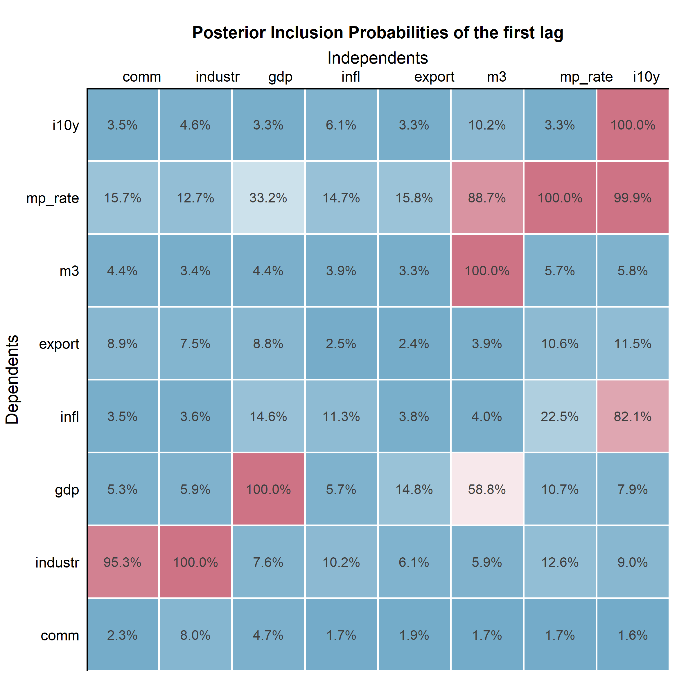
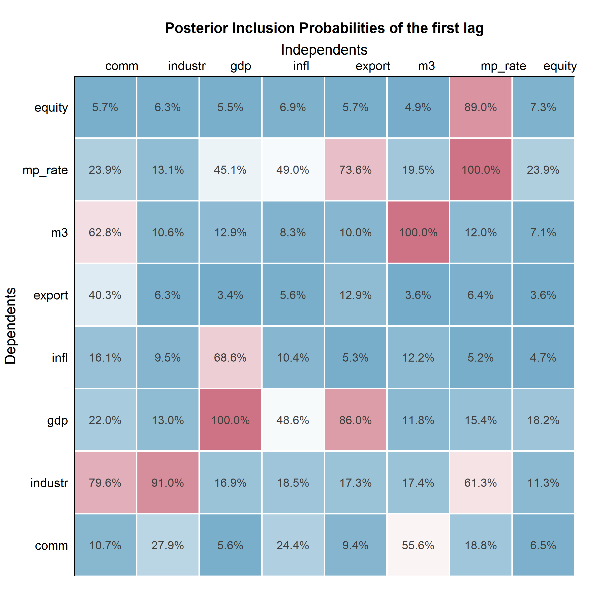
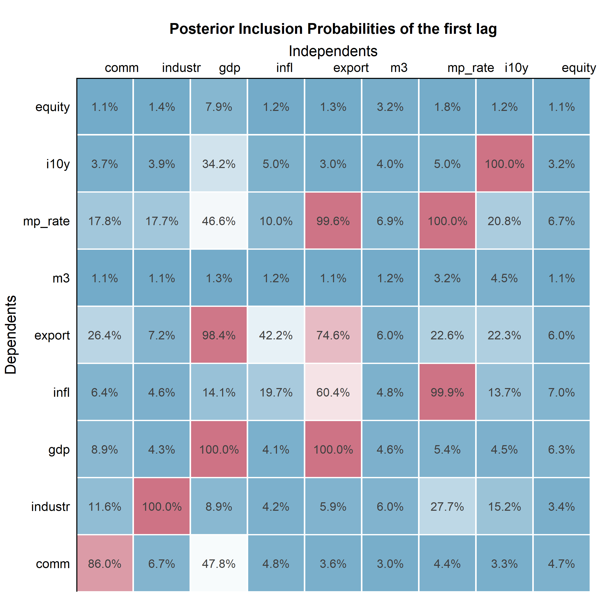
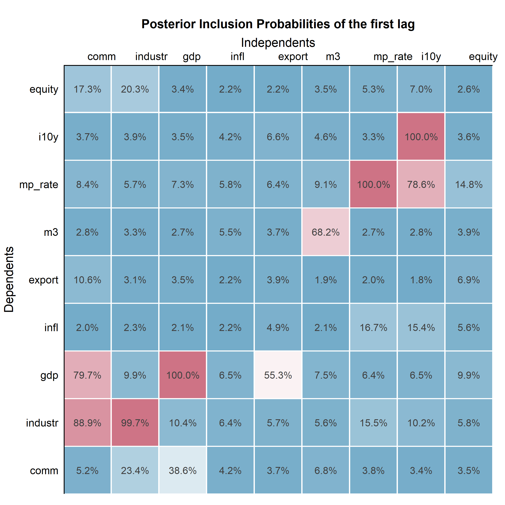

# Appendix

### PCA  

To establish which index data was to be used for our VAR-Model we have run multiple PCA’s with different data sets. As can be seen in the table below, the KMO-Criterion of the datasets with different starting dates were not ideal for PCA. 

```{r, echo = FALSE, eval = TRUE}
suppressMessages(
  readr::read_delim("./appendix/table_pca.csv", ";", na = "") %>% 
    knitr::kable(format = "latex", booktabs = TRUE, caption = "Table X, Selection of PC Analyses") %>% 
    kableExtra::kable_styling()
)
```

Additionally, it must be mentioned that the PCA analysis was also done with other timeseries such as with the precious metals by S&P. However, this yielded insufficient results on the Bartlett’s Sphere test and KMO-criterion. Since some timeseries were not loaded to the components, the PCA was repeated, neglecting these timeseries (Maier & Hatzinger, 2014). Therefore an iterative approach was taken, reducing the amount of components and variables if components did not load variables or variables did not load into components as was described by Maier & Hatzinger (2014). This resulted in a PCA with the following timeseries:


The screeplot above reveals that two components have an eigenvalue higher than 1. Which is depicted by the horizontal line in the figure. This has given a strong indication that the optimal amount of components in the PCA is two.

As can be seen in the table below, the principal components that can be identified have an eigenvalue of 7.79 and 2.68 respectively. This indicates that both components can be used going forward, as both are well above the cut-off-value. Additionally, we can see that component 1 “explains” 60 percent of the sample variability, whereas component 2 manages to capture 21 percent of the variance. Cumulatively these components cover 81 percent of the total variance in the data set. This means that 81 percent of the information in the original data set is conserved when using these components.
The process of running the PCA was done iteratively, removing components that were not loading variables and variables that did not load to components with each iteration. Ending up with the Factor loadings that can be seen in the chapter results.

|Component:            |  PC1|  PC2|
|:---------------------|----:|----:|
|SS loadings           | 7.79| 2.68|
|Proportion Var        | 0.60| 0.21|
|Cumulative Var        | 0.60| 0.81|
|Proportion Explained  | 0.74| 0.26|
|Cumulative Proportion | 0.74| 1.00|

\newpage

### Bayesian Model Averaging










